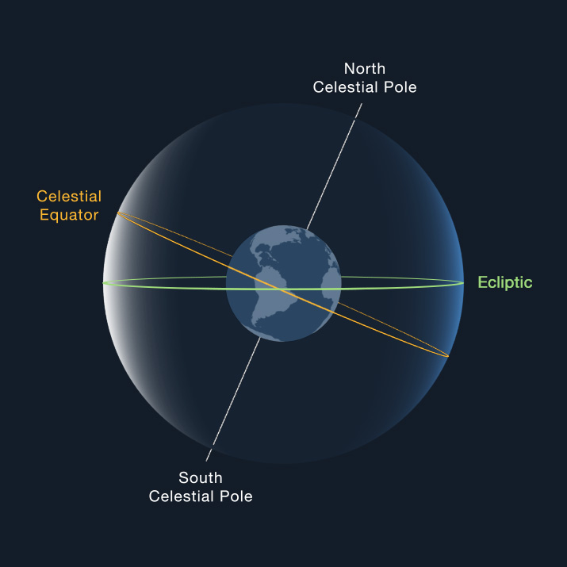

# Some Preliminary Informations

## The Coordinate System

### The Earth's Surface

Often called parallels or circles of latitude, latitudes are imaginary circles parallel to the equator. On a map where north is up, latitudes run laterally (left to right). They are named after the angle created by a line connecting the latitude and the center of the Earth, and the line connecting the equator and the center of the Earth.

Latitudes specify the north-south position of a location on the globe. Locations in the Northern Hemisphere are identified by northern latitudes and are assigned a suffix of N for north. Southern Hemisphere locations, on the other hand, are on southern latitudes and are assigned a suffix of S for south.

Longitudes are geographical positioning markers that run from the geographical North Pole to the geographical South Pole, intersecting the equator. They meet at both poles and specify the east-west position of a location. On a map where north is up, longitudes run vertically.

Longitudes are, therefore, imaginary circles that intersect the North and South Poles and the equator. Half of a longitudinal circle is known as a meridian. Meridians are perpendicular to every latitude.

Unlike, latitudes, there is no obvious central longitude. However, in order to measure the position of a location based on the longitude, cartographers and geographers over the course of history have designated different locations as the main longitudinal reference point. Today, the meridian line through Greenwich, England, is considered as the reference point for longitudes. This line is also known as the Prime Meridian.

[Referenec](https://www.timeanddate.com/geography/longitude-latitude.html)

### The Celestial Sphere

A useful construct for describing locations of objects in the sky is the celestial sphere, which is considered to have an infinite radius. The center of the earth is the center of the celestial sphere, and the sphere's pole and equatorial plane are coincident with those of the earth.

The point on the celestial sphere directly overhead for an observer is the **zenith**. An imaginary arc passing through the celestial poles and through the zenith is called the observer's **meridian**. The **nadir** is the direction opposite the zenith: for example, straight down from a spacecraft to the center of the planet.

#### Declination and Right Ascension

**Declination (DEC)** is the celestial sphere's equivalent of latitude and it is expressed in degrees, as is latitude. For DEC, + and - refer to north and south, respectively. The celestial equator is 0° DEC, and the poles are +90° and -90°.

**Right ascension (RA)** is the celestial equivalent of longitude. RA can be expressed in degrees, but it is more common to specify it in hours, minutes, and seconds of time: the sky appears to turn 360° in 24 hours, or 15° in one hour. So an hour of RA equals 15° of sky rotation. The zero point for RA is one of the points where the ecliptic circle intersects the celestial equator circle. It's defined to be the point where the sun crosses into the northern hemisphere beginning spring: the vernal equinox.

> Another important feature intersecting the celestial sphere is the **ecliptic** plane. This is the plane in which the Earth orbits the sun, 23.4° from the celestial equator. The great circle marking the intersection of the ecliptic plane on the celestial sphere is where the sun and planets appear to travel, and it's where the Sun and Moon converge during their eclipses (hence the name).

> The RA and DEC of an object specify its position uniquely on the celestial sphere just as the latitude and longitude do for an object on the Earth's surface. For example, the very bright star Sirius has celestial coordinates 6 hr 45 min RA and -16° 43' DEC.
> 

[Reference 1](https://solarsystem.nasa.gov/basics/chapter2-2/) [Reference 2](https://www.pas.rochester.edu/~blackman/ast104/coordinates.html)

## Great Circle?

A Great Circle is any circle that circumnavigates the Earth and passes through the center of the Earth. A great circle always divides the Earth in half, thus the Equator is a great circle (but no other latitudes) and all lines of longitude are great circles. The shortest distance between any two points on the Earth lies along a great circle.

